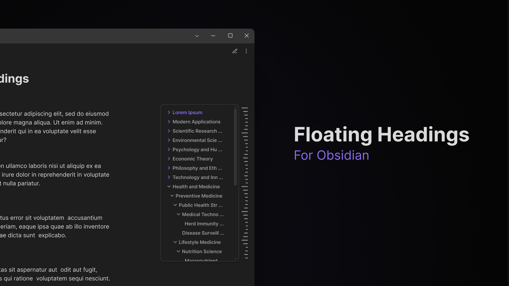

# Floating Headings

An Obsidian plugin that displays a floating, collapsible outline of your note's headings on the right side of the editor.



## Features

-   **Floating sidebar**: Collapsed view with visual heading indicators
-   **Hover expansion**: Full heading text in expandable panel
-   **Click navigation**: Jump to any heading instantly
-   **Filter search**: Search and filter headings in real-time
-   **Collapsible groups**: Expand/collapse heading hierarchies
-   **Position control**: Left/right sidebar placement and vertical positioning
-   **Level filtering**: Show only specific heading levels (H1-H6)
-   **Custom parsing**: HTML tag stripping and regex pattern support
-   **Theme adaptive**: Automatically matches your Obsidian theme

### Adapts to Themes


## Installation

### Manual Installation

1. Download the latest release from the [releases page](https://github.com/k0src/Floating-Headings-Obsidian-Plugin/releases).
2. Extract the files to your vault's `.obsidian/plugins/floating-headings/` folder.
3. Enable the plugin in Obsidian's Community Plugins settings.

### From Obsidian Community Plugins

_Coming soon_

## Settings

Access via **Settings → Community Plugins → Floating Headings**

### Basic

-   **Enable plugin**: Toggle on/off
-   **Enable filter**: Search headings in expanded panel
-   **Hide panel on navigation**: Auto-hide after clicking headings
-   **Sidebar position**: Left or right side placement
-   **Vertical position**: Sidebar vertical positioning (0-100%)
-   **Maximum heading level**: Filter by heading level (1-6)

### Appearance

-   **Panel width**: Expanded panel width (180-400px)
-   **Panel max height**: Maximum panel height (100-800px)
-   **Panel scroll position**: Top, previous position, or current header
-   **Sidebar width**: Collapsed sidebar width (8-48px)
-   **Line thickness**: Heading indicator line thickness (1-8px)
-   **Animation duration**: Transition speed (50-500ms)

### Advanced

-   **Parse HTML elements**: Strip HTML tags from headings
-   **Custom regex**: Define custom heading patterns with named groups

> [!NOTE] 
> **The parser processes heading text according to settings priority:**
>
> 1. If a custom Regex pattern is enabled, the `heading_text` named group is displayed in the panel. No other cleaning or filtering is applied.
> 2. If "Parse HTML" is enabled, then HTML tags are removed, then Markdown headings are cleaned.
> 3. If no parsing options are enabled, Markdown heading are cleaned, and the heading text is displayed as-is.

### Custom Regex

Custom Regex patterns can be used to parse and extract heading text from headers. By default, the panel shows the raw text of the heading. If you want to extract specific text, you can define a custom regex pattern, using a named capture group heading_text.

#### Custom Regex Examples

**Link heading**

-   **Regex pattern:**
    ```regex
    /^(#{1,6})\s+\[\[(?<heading_text>[^\]]+)\]\]\s*$/
    ```
-   **Example match:**
    ```
    # [[Some Page]]
    ```
-   **Extracted heading text:** `Some Page`

**Inline LaTeX**

-   **Regex pattern:**
    ```regex
    /^(#{1,6})\s+\$(?<heading_text>[^$]+)\$\s*$/
    ```
-   **Example match:**
    ```
    ## $O^n$
    ```
-   **Extracted heading text:** `O^n`

**List heading**

-   **Regex pattern:**
    ```regex
    /^(#{1,6})\s+[a-zA-Z]\.\s+(?<heading_text>.+)$/
    ```
-   **Example match:**
    ```
    #### a. List Heading
    ```
-   **Extracted heading text:** `List Heading`

## Customization

This plugin uses Obsidian's built-in CSS variables for consistent theming.

### CSS Variables

Override these custom properties to change the appearance of the plugin:

```css
--floating-headings-collapsed-width: 16px;
--floating-headings-panel-width: 240px;
--floating-headings-panel-max-height: 400px;
--floating-headings-panel-bg: var(--background-primary);
--floating-headings-line-color: var(--text-muted);
--floating-headings-line-thickness: 3px;
--floating-headings-animation-duration: 150ms;
--floating-headings-vertical-position: 50%;
```

### CSS Classes

Add custom styles in your snippets folder:

```css
.floating-headings-container {
	/* Main container */
}

.floating-headings-collapsed {
	/* Collapsed sidebar */
}

.floating-headings-expanded {
	/* Expanded panel */
}

.floating-heading-item {
	/* Individual headings */
}

.floating-heading-item.active {
	/* Current heading */
}

.floating-heading-item[data-level="1"] {
	/* H1 headings */
}
```

## Development

```bash
npm install    # Install dependencies
npm run dev    # Development mode
npm run build  # Production build
```

## Contributing

Issues and pull requests welcome on [GitHub](https://github.com/k0src/Floating-Headings-Obsidian-Plugin).

## License

MIT License - see [LICENSE](LICENSE) file.
